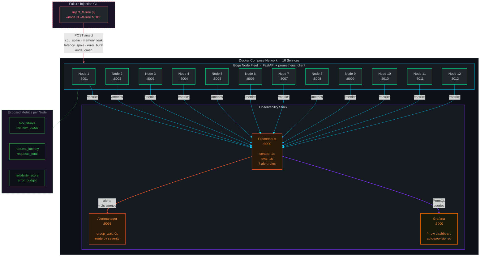

<p align="center">
  
</p>

<p align="center">
  <strong>A portfolio-grade distributed monitoring platform demonstrating SRE/observability skills.</strong><br>
  Runs 12 simulated edge nodes with Prometheus, Grafana, and Alertmanager, all orchestrated via Docker Compose.
</p>

---

## Architecture



## Quick Start

```bash
# Start all 16 services
docker compose up --build -d

# Open Grafana dashboard (no login required)
open http://localhost:3000

# View Prometheus targets
open http://localhost:9090/targets

# View Alertmanager
open http://localhost:9093
```

## Metrics

Each edge node exposes the following Prometheus metrics:

| Metric | Type | Description |
|--------|------|-------------|
| `node_cpu_usage_percent` | Gauge | Simulated CPU usage (10-85% with drift) |
| `node_memory_usage_percent` | Gauge | Simulated memory usage (20-75% with drift) |
| `node_request_latency_seconds` | Histogram | Request latency (log-normal distribution) |
| `node_requests_total` | Counter | Total requests (labeled `status=success/error`) |
| `node_uptime_seconds` | Gauge | Time since node start |
| `node_error_rate` | Gauge | Current error rate (0-1) |
| `reliability_score` | Gauge | Weighted composite SRE metric |
| `error_budget_remaining` | Gauge | Error budget remaining (99.9% SLO target) |

## Alerting

Prometheus evaluates alert rules every 1s with `for: 0s` for sub-2-second detection:

| Alert | Condition | Severity |
|-------|-----------|----------|
| HighCPUUsage | CPU > 90% | warning |
| HighMemoryUsage | Memory > 85% | warning |
| HighErrorRate | Error rate > 5% | critical |
| HighLatency | p95 latency > 1s | warning |
| NodeDown | Target unreachable | critical |
| LowReliabilityScore | Score < 0.95 | warning |
| ErrorBudgetBurn | Budget < 50% | critical |

## Failure Injection

Use the injection script to test alerting and dashboard responsiveness:

```bash
# Spike CPU on node 3 for 30 seconds
python scripts/inject_failure.py --node 3 --failure cpu_spike --duration 30

# Simulate memory leak on node 7
python scripts/inject_failure.py --node 7 --failure memory_leak --duration 60

# Inject latency spike across all nodes
python scripts/inject_failure.py --node all --failure latency_spike --duration 20

# Trigger error burst on node 5
python scripts/inject_failure.py --node 5 --failure error_burst --duration 30

# Crash node 10
python scripts/inject_failure.py --node 10 --failure node_crash --duration 45
```

### Failure Modes

| Mode | Effect |
|------|--------|
| `cpu_spike` | CPU jumps to 95-100% |
| `memory_leak` | Memory climbs steadily to 95%+ |
| `latency_spike` | Latency increases 10x |
| `error_burst` | Error rate jumps to 20-50% |
| `node_crash` | Node returns 503 on all endpoints |

## Grafana Dashboard

The pre-provisioned dashboard includes four rows:

1. **Overview** - Active nodes, reliability score, error budget, platform health gauge
2. **Resource Utilization** - CPU and memory time series for all 12 nodes
3. **Request Metrics** - Request rate, p50/p95/p99 latency, error rate per node
4. **SRE Metrics** - Reliability score, error budget consumption, active alerts

## Project Structure

```
├── docker-compose.yml              # Orchestrates all 16 services
├── edge-node/
│   ├── Dockerfile                  # Python 3.11 slim image
│   ├── requirements.txt            # FastAPI + prometheus-client
│   └── simulator.py                # Edge node simulator
├── prometheus/
│   ├── prometheus.yml              # Scrape config (1s interval)
│   └── rules/
│       └── alerts.yml              # 7 alert rules
├── alertmanager/
│   └── alertmanager.yml            # Alert routing config
├── grafana/
│   └── provisioning/
│       ├── dashboards/
│       │   ├── dashboards.yml      # Dashboard provider
│       │   └── telemetry.json      # Pre-built dashboard
│       └── datasources/
│           └── datasource.yml      # Prometheus datasource
└── scripts/
    └── inject_failure.py           # Failure injection CLI
```

## Teardown

```bash
docker compose down
```
